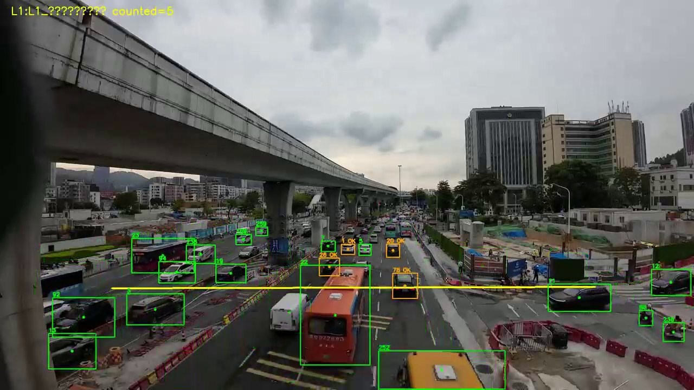

# count-yolo

Fixed-camera intersection counting with YOLO tracking and **layered evaluation** (L1 line → L3 origin-destination). A field script, not a product.

用固定摄像头视频，自动统计交叉口各进口的左转 / 直行 / 右转辆次，并按车型分类。这是给交通调查用的脚本，不是 SaaS，也不训练模型。YOLO 本身是现成的；真正花时间的是验收怎么分层，以及通用权重漏掉的摩托车怎么补。

## 一个实际用得上的结论

视频质量决定验收层级。远景、遮挡严重的匝道素材只验 **L1 近场过线**，不要拿它证明四进口全矩阵。

在示例匝道视频（南进口直行，22 分钟，人工对照 1533 辆）上：

| 方案 | 合计 | vs GT |
|------|------|-------|
| yolov8m 单模型 | 1304 | -14.9% |
| 电自/摩托专用权重单模型 | 1112 | -27.5% |
| yolov8m 四轮 + 专用权重摩托（事后拼接） | 1520 | -0.8% |

漏检主因是 COCO 权重几乎看不见摩托（只检出 2 辆）。降检测阈值无效：0.15 和 0.25 全片结果完全相同。对向车道和潮汐车道靠轨迹方向过滤，靠收窄计数线会把同向潮汐车道一起裁掉。

L3（entry/exit 多边形 + 转向查表）代码里有骨架，示例视频上完整轨迹经常是 0，所以本仓库不把它写成已验证能力。

## L1 过线计数画面

120 秒冒烟，用来看计数链路是否在工作：黄线是标定的近场计数线，绿框为跟踪中，橙框为已过线计入。这是可视化验证，不是全片 22 分钟的精度合同；全片数字仍以表格和 `examples/` 为准。


静帧：



## 当前能做什么

已实现：标定一条计数线 → YOLO + ByteTrack 过线计数 → JSON → 和人工调查表比对。

未做：双模型单遍融合、自动写入 Excel 统计表、L3 八区标定 GUI。换机位更好的十字口视频之前，这些都不该作为卖点。

## Quick start

Python ≥ 3.10。离线测试不需要 GPU 和视频。

```powershell
python -m venv .venv
.\.venv\Scripts\Activate.ps1
pip install -e ".[dev]"
python -m pytest tests/ -q
```

跑视频计数再装运行时依赖（首次会拉取 YOLO 权重，体积较大）：

```powershell
pip install -e ".[runtime]"
copy .env.example .env
.\run.ps1 8m --mode line --line L1_南直行 --device 0 --max-seconds 120
.\run.ps1 compare --counts examples\counts_L1_south_through_yolov8m.json --level L1
```

Linux / macOS 用 `./scripts/run.sh`。视频、权重、debug 录像默认不进 git，把 MP4 放到仓库根目录，把 `yolov8m.pt` 放到 `models/`（缺失时 ultralytics 可能自动下载）。

标定计数线会弹窗（需要本机显示器）：

```powershell
.\run.ps1 annotate --image output\frame_ref.jpg --line L1_南直行 --direction near_to_far
```

`opencv-python` 和 `opencv-python-headless` 不能同时装，否则窗口起不来。

## 仓库结构

```text
src/count_yolo/     计数、标定、比对的源码
scripts/            run.ps1 / run.sh
tests/              离线单测（几何、车型映射、GT 误差）
configs/            示例路口标定
ground_truth/       人工调查对照
examples/           已发表的全片 JSON（无本机路径）
docs/               prd / rfc / working / test
docs/assets/        L1 120 秒 overlay 演示与静帧
```

根目录的 `count_traffic.py`、`annotate_line.py`、`compare_ground_truth.py` 是兼容入口。隔一段时间回来看 [`阶段总结.md`](阶段总结.md)；交给别人看 [`交接说明.md`](交接说明.md)。

## Privacy

This repository is designed to be publishable with only fake examples. `.env.example` uses placeholders. Weights, Excel templates, and runtime `output/` are gitignored. The 120-second clip in `docs/assets/` is a published field-camera demo for the L1 overlay; other videos stay local. Published JSON fixtures store filenames only, not local absolute paths.

## License

MIT
